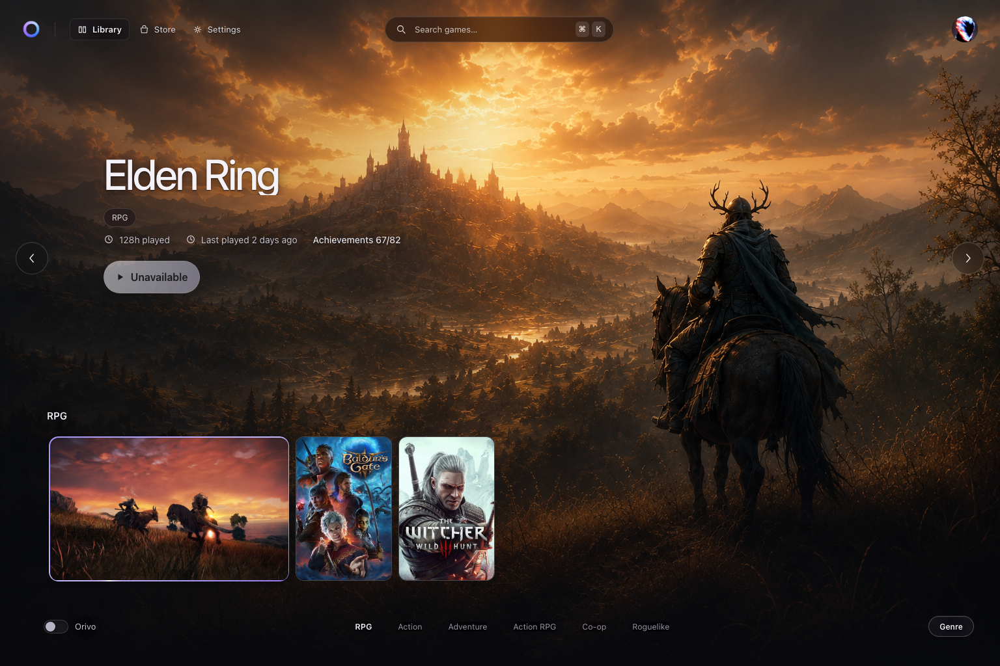
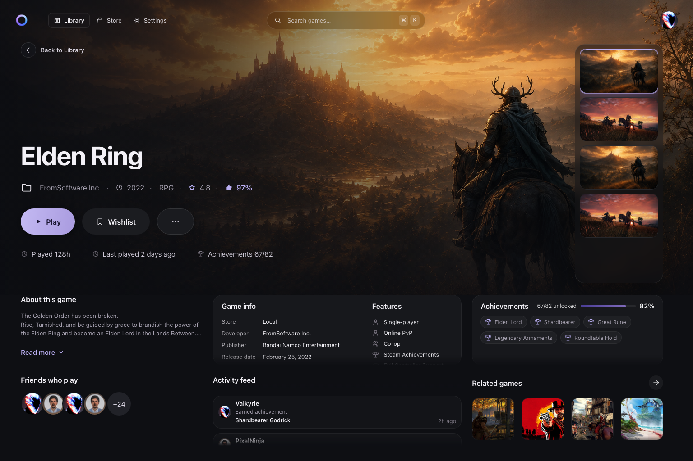
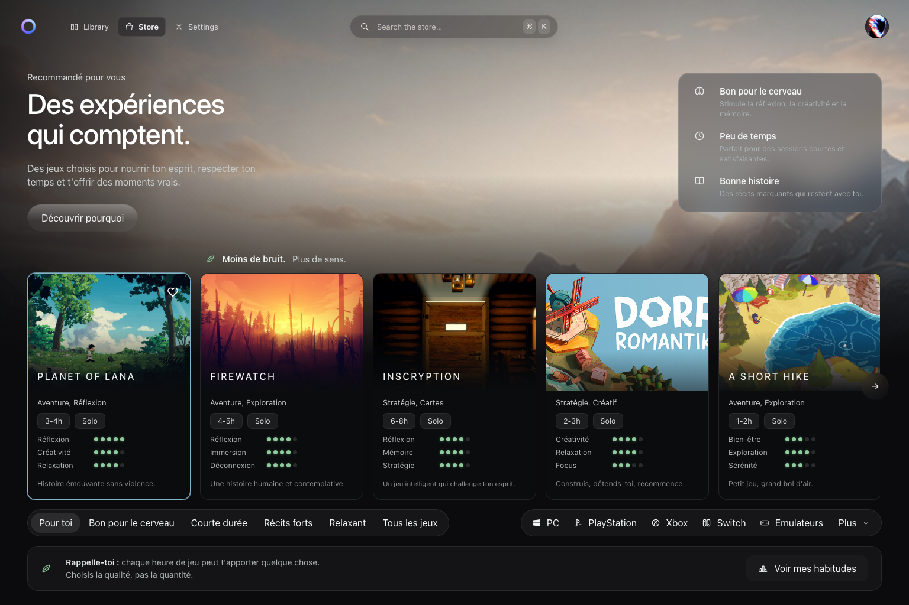
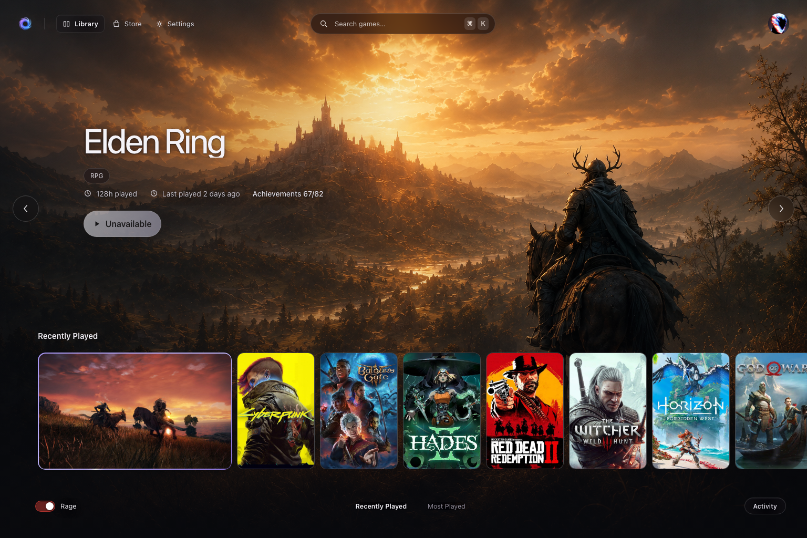
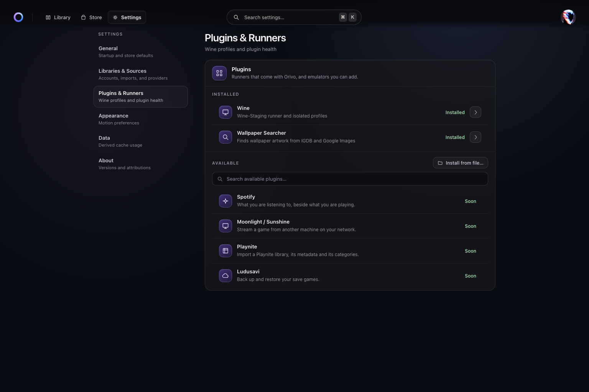

<div align="center">


# Orivo

**Every game you own, in one place that looks like it was made for them.**

A local-first game library for macOS, Windows and Linux. Your Steam, Epic, GOG,
Ubisoft, Xbox, Microsoft Store and Instant Gaming libraries side by side, in a
full-screen selector built to be read across a room and driven with a
controller.

[](https://github.com/justeozan/orivo/releases)
[](https://tauri.app)
[](#install)
[](LICENSE)

</div>

---


## What it is

A launcher spends its life showing you other people's artwork. Orivo is built
around that: the wallpaper is the page, the game's own wordmark stands where a
title would, and the interface stays out of the way until you ask it something.

- **One library, seven stores.** Steam, Epic Games, GOG, Ubisoft Connect, Xbox,
  Microsoft Store and Instant Gaming, plus anything on your own disk. Sign in
  once per store; the credentials go to the system keychain and never cross into
  the interface.
- **Local-first.** Your library lives in a file on your machine. Orivo reads the
  stores you connect, and nothing else leaves the app.
- **Built for a controller.** Arrow keys and a gamepad reach every control,
  because a library you browse from the sofa is the point.
- **Windows games on a Mac.** A Wine-Staging runner with isolated profiles, so a
  Windows-only title in your library is a game you can start rather than a row
  you scroll past.

## Browsing

One button cycles how the library is read — by activity, genre, store or
platform — and the row beside it holds that mode's shelves. The heading, the
rail and the hero always agree about what is on screen.



## A game's page

Everything a game has to say, in one screen. Nothing scrolls off the bottom: the
artwork takes two thirds, and the panels share the rest.



## A store that tells you what a game costs

Prices from the stores you already use, with the honesty rules written into the
code: an offer with no price shows no digits, and a provider that is down says so
rather than quietly returning nothing.



## A mood, because why not

The switch at the foot of the library turns the accent — and the mark — red.
It changes nothing about your games.



## Settings

Runners and plugins, connected accounts, cache usage, and the update panel.



## Install

Grab the latest build from the [releases page](https://github.com/justeozan/orivo/releases/latest).

| Platform | File |
| --- | --- |
| macOS (Apple Silicon) | `Orivo_aarch64.dmg` |
| macOS (Intel) | `Orivo_x64.dmg` |
| Windows | `Orivo_x64-setup.exe` |
| Linux | `.AppImage`, `.deb` or `.rpm` |

**Orivo is not code-signed yet.** On macOS, drag it to Applications, then
**right-click → Open → Open** the first time; Gatekeeper blocks a plain
double-click and remembers your choice afterwards. If macOS says the app is
*damaged* instead, clear the download quarantine:

```sh
xattr -dr com.apple.quarantine /Applications/Orivo.app
```

On Windows, click **More info → Run anyway** on the SmartScreen prompt.

### Updates

Orivo updates itself. It checks once shortly after launch and tells you in
**Settings › About**; nothing downloads until you press the button, and
installing is one restart — no uninstall, no reinstall. Every update is signed
with minisign and refused if the signature does not match.

## Building from source

```sh
pnpm install
pnpm tauri dev     # the desktop app
pnpm dev           # the frontend alone, in a browser, on fixture data
```

```sh
pnpm typecheck && pnpm test    # TypeScript + unit tests
pnpm test:e2e                  # Playwright, needs the dev server
cargo test --manifest-path src-tauri/Cargo.toml
```

Requires Node 22, pnpm 11 and a stable Rust toolchain. On Linux you also need
`libwebkit2gtk-4.1-dev` and `libgtk-3-dev`.

## Where it is going

Named rather than promised: these are visible in **Settings › Plugins**, marked
*Soon*.

- **Spotify** — what you are listening to, beside what you are playing.
- **Moonlight / Sunshine** — stream a game from another machine on your network.
- **Playnite** — import a Playnite library, its metadata and its categories.
- **Ludusavi** — back up and restore your save games.

Emulator sources, a richer Store and the **Me** dashboard (already behind
*Settings › Appearance › Beta features*) are the surfaces being built next.

## The documents that govern the code

Orivo is written against these specifications, and they are worth reading before
a pull request:

- [`docs/DESIGN.md`](docs/DESIGN.md) — the design system, down to why a panel fades at the
  bottom instead of being cut off.
- [`docs/ARCHITECTURE.md`](docs/ARCHITECTURE.md) — the boundaries: what the WebView may
  know, what only Rust may do, and the performance budget.
- [`docs/RELEASING.md`](docs/RELEASING.md) — how a version is cut, signed and
  published.
- [`docs/selector-contract.md`](docs/selector-contract.md) — what the selector
  guarantees about focus, and what may never move under a player's thumb.

## What leaves your machine

Local-first is a claim, so here is the whole of it.

- **Your library is a file on your disk.** Orivo has no account, no server of
  its own, and nothing to sync to. Uninstalling takes the library with it.
- **Credentials live in the system keychain** — Keychain on macOS, Credential
  Manager on Windows, the Secret Service on Linux. Rust reads them; the WebView
  never sees a token, and neither do the logs.
- **Network calls go to the stores you connected**, and to the metadata and
  artwork providers behind the covers you see — Steam, Epic, GOG, Ubisoft, Xbox
  and Microsoft Store for your libraries; IGDB, SteamGridDB, Openverse and
  Wikimedia Commons for artwork and wallpapers. Connect nothing, and Orivo
  talks to nothing.
- **Crash reports carry no identity.** Official builds ship a Sentry key so the
  in-app feedback button has somewhere to send a report, and errors ride along
  with it; the SDK runs with `sendDefaultPii: false`, so no name, email or IP
  address is attached. There is no in-app switch for it yet. A build from source
  has no key compiled in at all: it never opens the socket, and it hides the
  feedback button rather than leaving a control that does nothing. See
  [`.env.example`](.env.example).
- **The updater checks one URL** — a signed manifest on this repository's
  releases page — and downloads nothing until you press the button.

## Contributing

Issues and pull requests are welcome — read [`CONTRIBUTING.md`](CONTRIBUTING.md)
first. It covers the local loop, the house style, and the contributor licence
terms, which you accept by opening a pull request.

## Licence

**Orivo is source-available, not open source.** It is licensed under the
[PolyForm Noncommercial License 1.0.0](LICENSE).

You may use, copy, modify and share Orivo freely for any **noncommercial**
purpose: your own machine, hobby projects, study and research, and use by
schools, charities, public research bodies and government institutions. Fork it,
change it, publish your fork — all fine, as long as it stays noncommercial and
carries this licence with it.

You may **not** use Orivo, or anything derived from it, commercially. That
includes selling it, bundling it with a paid product or a device, running it as
part of a business's operations, and offering it — or a fork of it — as a hosted
or managed service.

The copyright holder keeps every commercial right, including the right to run
Orivo as a service. **Commercial licences are available**: if you want to do
something these terms do not allow, write to <contact@oneiby.com> and ask.

Copyright © 2026 Ozan Sahin.

### Third-party components

Orivo bundles [Tauri](https://tauri.app) and a set of Rust and TypeScript
dependencies under their own licences — `Cargo.lock` and `pnpm-lock.yaml` are
the authoritative list. Nearly all are permissive (MIT, Apache-2.0, BSD, ISC or
Zlib). One is not: [`option-ext`](https://github.com/soc/option-ext) is
MPL-2.0, a file-level copyleft, and it is linked into the shipped binaries. Its
source is available at that link, and its terms cover only its own files — they
place no condition on Orivo's own code or on the licence above.

Two things are *not* bundled and keep their own terms entirely: **Wine-Staging**,
which you install yourself and point Orivo at through a native picker, and the
pinned **DXVK-macOS** build the Wine runner downloads and verifies on demand.

### Trademarks

Steam, Epic Games, GOG, Ubisoft Connect, Xbox, Microsoft Store and Instant
Gaming are trademarks of their respective owners. Orivo is an independent
project and is not affiliated with, endorsed by, or sponsored by any of them.
Game titles, artwork and wordmarks shown in this README and in the app belong to
their publishers; Orivo displays them, it does not license them to you.
