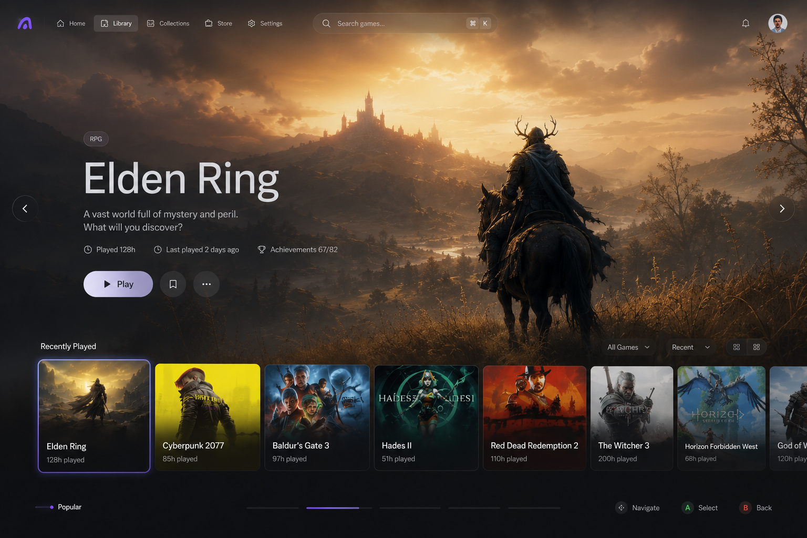
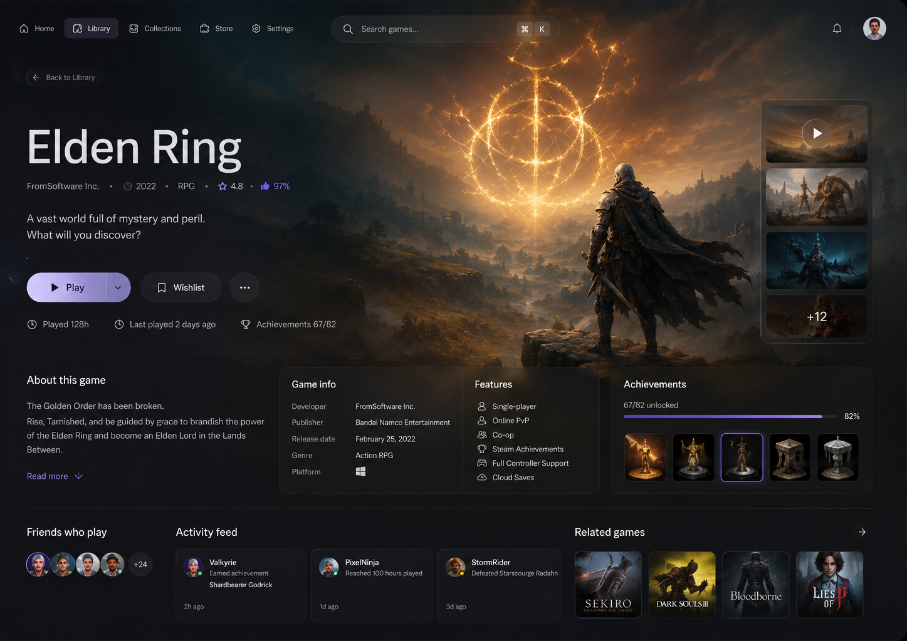
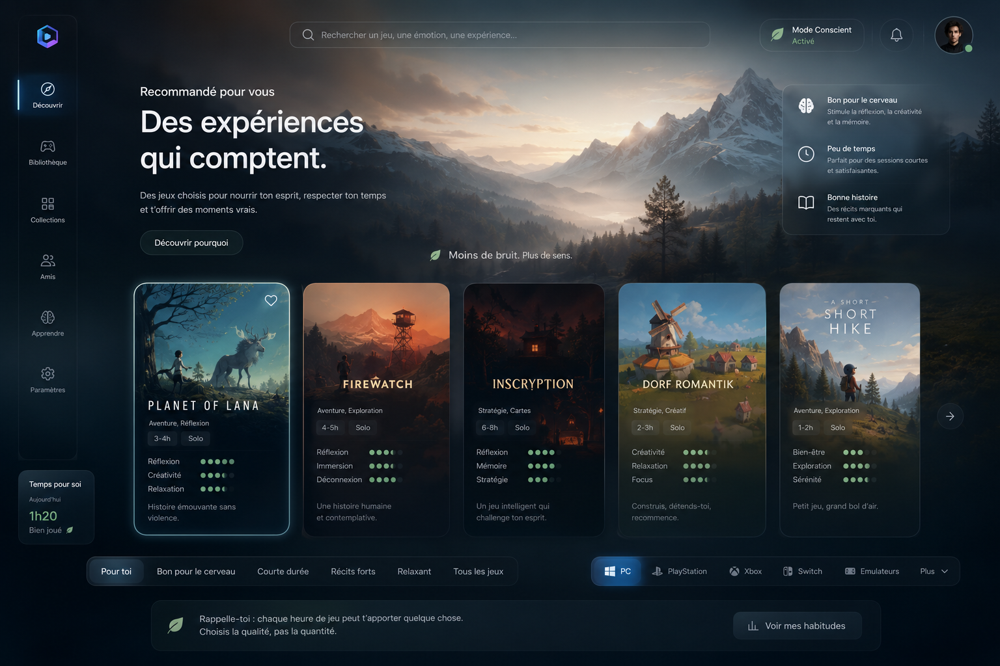
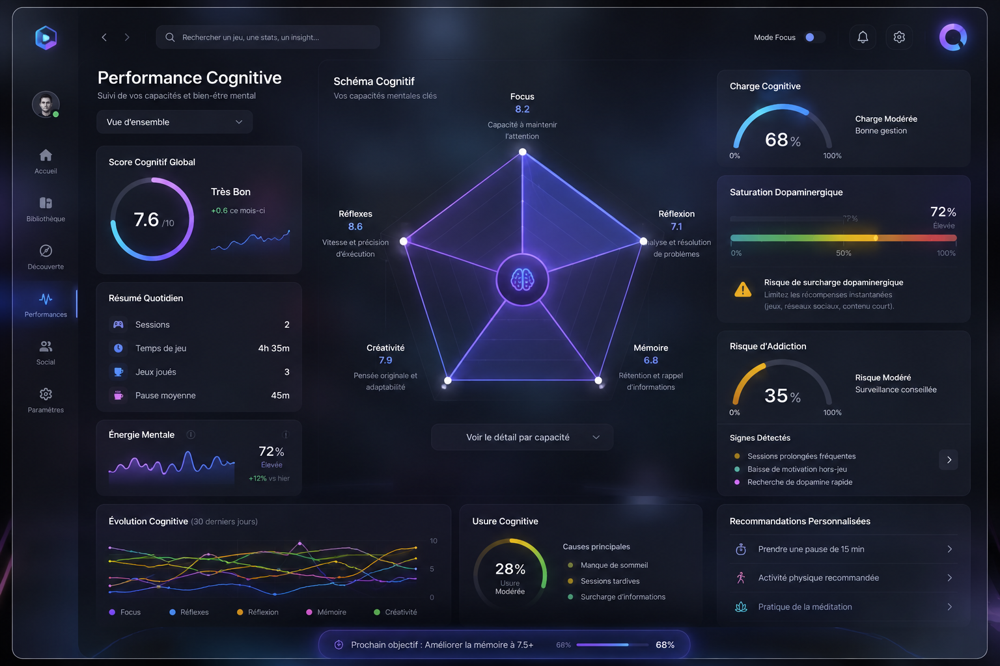

<div align="center">
  

  # Orivo

  **Un Gaming OS local-first pour PC — pas juste un énième launcher.**

  
  
  
  

</div>

---

## À propos

Orivo réunit dans une seule application ce que Steam, Epic, GOG et les émulateurs éparpillent aujourd'hui entre dix launchers différents : la bibliothèque, la découverte, le lancement, la progression, et bientôt les mods, le social et l'IA locale.

Les plateformes existantes ne sont pas remplacées : elles deviennent de simples **fournisseurs de contenu** derrière une seule interface cohérente, rapide et cinématographique.

Principes qui guident le projet ([voir `ARCHITECTURE.md`](./ARCHITECTURE.md) pour le détail) :

- **Local-first** — la bibliothèque, la recherche et le lancement fonctionnent sans serveur distant.
- **UI non bloquante** — l'interface n'attend jamais une synchronisation ou une jaquette externe.
- **Une source de vérité** — SQLite en local, tout le reste n'est qu'une projection dérivée.
- **Composition native au WebView** — pas de moteur de rendu superflu tant que le profilage ne le justifie pas.
- **Accessibilité explicite** — clavier, manette, contraste et réduction des animations dès la conception.

## Captures d'écran

### Le Selector — vue actuelle du projet

Écran de sélection plein écran, navigable au clavier comme à la manette : hero du jeu sélectionné, rail « Recently Played », HUD de navigation.



### Fiche détail d'un jeu



### Aperçus de la roadmap (maquettes)

Ces écrans sont des maquettes de direction produit, pas encore implémentées — elles servent de référence de conception pour le Store et la page de suivi personnel.

<table>
  <tr>
    <td width="50%"><br /><sub>Store — découverte par intention, filtrable par plateforme</sub></td>
    <td width="50%"><br /><sub>Page « Moi » — suivi du temps de jeu et du bien-être</sub></td>
  </tr>
</table>

## Plateformes prises en compte

**Système d'exploitation (app desktop, via Tauri v2)**

| OS | Statut |
| --- | --- |
| macOS | Cible de développement principale actuelle |
| Windows | Cible visée, validation du rendu WebView en cours |
| Linux | Envisagé (supporté par Tauri), non prioritaire pour l'instant |

**Sources de jeux / fournisseurs de contenu**

| Source | Statut |
| --- | --- |
| Steam | ✅ Implémenté — connexion de bibliothèque, scan local, installation, secrets dans le Trousseau système |
| Epic Games Store | Prévu |
| GOG | Prévu |
| Émulateurs (Switch, etc.) | Prévu, voir roadmap émulation |

La maquette du Store illustre aussi l'ambition d'agréger PC, PlayStation, Xbox, Switch et émulateurs dans une seule vue de découverte.

## Ambition & mini roadmap

L'ambition d'Orivo dépasse le simple launcher : devenir un véritable **Gaming OS** — découverte, bibliothèque, progression, mods, social contextuel, performances matérielles, espaces de jeu, plugins et IA locale, le tout dans une seule expérience cohérente.

Construction par phases ([détail complet dans `ARCHITECTURE.md`](./ARCHITECTURE.md#12-ordre-de-construction-recommandé)) :

- [x] **Phase 1 — Fondation utilisable** : runtime Tauri v2, navigation clavier/manette, catalogue local, connexion Steam, recherche, lancement de jeu.
- [ ] **Phase 2 — Identité visuelle** : hero plein écran, panneaux glass, écran Home avec « Continue Playing ».
- [ ] **Phase 3 — Valeur produit** : sessions & progression, Game Hub, feed & smart collections, statistiques, Gaming Spaces, social contextuel.
- [ ] **Phase 4 — Plateforme extensible** : SDK de plugins (Wasmtime/WIT), marketplace, intégrations (Discord, Spotify, mods), IA locale et recommandations.

Prochaines briques identifiées ([`TODOS.md`](./TODOS.md)) :

- Émulation simplifiée sur machines non compatibles (ex. jeux PC émulés sur Mac).
- Page **Store** : parcourir les jeux par catégorie/source sans les ajouter à sa bibliothèque, comparaison de prix.
- Page détail de jeu enrichie : sélecteur de fond d'écran, vidéos, icônes et covers.
- Page **Moi** : indicateurs quantitatifs de bien-être et d'habitudes de jeu.
- IA connectée à l'ensemble de l'app pour la suggestion de jeux.

## Stack technique

- **Runtime** : [Tauri v2](https://tauri.app) — process Rust + WebView système.
- **Frontend** : TypeScript + CSS (Vite), volontairement léger, sans framework UI lourd.
- **Backend natif** : Rust (catalogue, lancement, intégration Steam, accès système).
- **Stockage local cible** : SQLite + FTS5 pour la recherche.

## Démarrage rapide

Prérequis : [pnpm](https://pnpm.io), [Rust](https://www.rust-lang.org/tools/install) et les [prérequis système de Tauri v2](https://tauri.app/start/prerequisites/).

```bash
# Installer les dépendances
pnpm install

# Lancer l'app desktop en mode développement
pnpm tauri dev

# Ou uniquement le frontend web (sans le shell Tauri)
pnpm dev
```

Autres scripts utiles : `pnpm build` (typecheck + build web), `pnpm typecheck`.

## Structure du projet

```
src/            frontend TypeScript/CSS (Vite)
src-tauri/      backend Rust : catalogue, lancement, intégration Steam
assets/         jaquettes, heroes, maquettes de référence produit
docs/           notes techniques (contrat de sélecteurs, revue visuelle)
ARCHITECTURE.md architecture cible et vision produit détaillée
DESIGN.md       système de design (couleurs, typographie, layouts)
TODOS.md        backlog produit priorisé
```

## Contribuer

Orivo est en développement actif et le projet est ouvert aux contributions. Avant de proposer un changement, jetez un œil à `ARCHITECTURE.md` et `DESIGN.md` pour rester cohérent avec les principes et le système visuel déjà en place.

## Licence

La licence du projet n'est pas encore définie.
